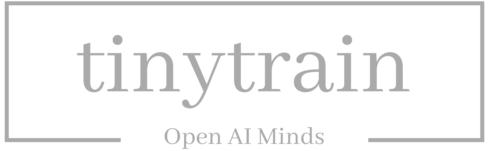

<p align="center">
  
</p>

<div align="center">

[](https://github.com/zycskylove520/TinyTrain/stargazers)

[](https://github.com/zycskylove520/TinyTrain/commits/master)
[](LICENSE)
[](https://github.com/zycskylove520/TinyTrain/pulls)


</div>

<h3 align="center">配置驱动全栈AI框架 · 开启模型构建无限可能</h3>

## 🎯 框架概述

**TinyTrain** 是一个基于 PyTorch 构建的**生产级全栈深度学习框架**，致力于为研究者和工程师提供高效、灵活的模型开发体验。通过高度模块化的架构设计，本框架显著降低了AI项目的工程复杂度，同时保持了科研所需的灵活性和扩展性。

## ✨ 核心特性

### 🚀 开发效率提升

- **开箱即用**: 预置经典模型和标准训练流程，快速启动项目
- **模块化设计**: 灵活组合训练组件，支持轻松定制和扩展
- **生产就绪**: 提供完整的训练、评估、可视化到模型导出全流程

### ⚡ 训练性能优化

- **高效训练**: 原生支持DDP分布式训练、混合精度、梯度累积等加速技术
- **轻量级架构**: 精简代码设计，低资源消耗，支持快速部署
- **多硬件支持**: 完整支持单机单卡、单机多卡及多机多卡训练(测试中)

### 🔧 实验管理

- **配置驱动**: 统一的 TOML/YAML 构建模型
- **实验跟踪**: 完整的训练过程监控和超参数记录
- **弹性扩展**: 高度模块化架构，支持自定义模块和算法扩展

## 📊 功能矩阵

| 领域      | 支持任务                | 主要模型                                                        |
|---------|---------------------|-------------------------------------------------------------|
| YOLO系列  | 图像分类、目标检测、姿态估计、实例分割 | YOLOv3、YOLOv5、YOLOv6、YOLOv8、YOLOv11、YOLOv12、Retinaface-YOLO |
| Face系列	 | 人脸识别	               | MobilefaceNet、ResNetFace、YOLOFace                           |
| OCR系列	  | 车牌识别	               | LPRNet、TTLPRNet                                             |

> 🔄 **持续扩展中** - 我们正在积极适配更多 AI 任务和算法模型

## 🏗️ 项目架构

```text
TinyTrain/
├── assets/         # 资源文件
├── cfg/            # 统一配置管理系统
├── data/           # 数据集与数据管道
├── engine/         # 核心引擎
├── global_var/     # 全局变量管理
├── labeling/       # 标注工具（开发中）
├── loss/           # 损失函数实现
├── metrics/        # 评估指标
├── models/         # AI模型架构实现
├── modules/        # 神经网络基础组件
├── server/         # 后端服务
├── test/           # 测试用例
├── tools/          # 实用工具脚本
├── tracker/        # 目标跟踪器
├── utils/          # 通用工具库
└── docs/           # 文档资源
```

## 🛠️ 安装指南

### 系统要求

* Python ≥ 3.8 (**推荐 3.10+**)
* PyTorch ≥ 1.9.0 (**推荐 2.0+**)
* CUDA ≥ 11.0 (**GPU训练推荐，建议 11.8+**)

### 快速安装

### 方式一：源码安装（推荐）

如需最新功能或进行二次开发，建议从源码安装：

```shell
git clone https://github.com/zycskylove520/TinyTrain.git
cd TinyTrain-main

# 开发模式安装（推荐）
pip install -e .

# 或生产模式安装
pip install .
```

#### 方式二：whl安装

我们提供预编译的 whl 包，可直接安装使用：

```shell
pip install tinytrain-*.whl
```

使用该方法安装建议直接使用提供好的examples目录下的项目。

## 🎯 快速开始

`TinyTrain` 所有已实现的 AI 模型都在 `tinytrain.models` 模块中，提供统一的接口设计。

### 模型训练

TinyTrain 采用配置驱动的训练方式，支持灵活的运行时参数覆盖：

```python
from tinytrain.models.yolo import YOLOCore

# 初始化核心引擎
yolo = YOLOCore(link_file=r"link.toml")

# 覆盖训练参数
yolo.set_config_overrides(
    link_type="core",
    epochs=100,
    batch_size=32,
    save_dir="runs/"  # 训练结果输出目录
    # resume=True,    # 恢复训练
    # device=[0,1]   # 多GPU训练
)

# 覆盖数据参数
# 配置dataset相关参数
yolo.set_config_overrides(
    link_type="dataset",
    img_size=640
)

# 开始训练
yolo.train(model_scale='n')  # 训练 nano 模型, 模型尺度：n, s, m, l, x

# 或从预训练权重开始
yolo.train(model_scale="n", model="pretrained.pt")
```

### 模型推理

#### 1. 训练后直接推理

```python
from tinytrain.models.yolo import YOLOCore

yolo = YOLOCore(r"link.toml")
yolo.train(model_scale='n')

# 单张图像推理
results = yolo.predict(source=r"xxx.jpg")
for result in results:
    print(result)
```

#### 2. 加载训练好的模型

```python
from tinytrain.models.yolo import YOLOCore

yolo = YOLOCore(r"link.toml")

# 使用最佳权重
results = yolo.predict(source=r"xxx.jpg", use_best_pt=True)
for result in results:
    print(result)

# 或指定权重文件
results = yolo.predict(source=r"xxx.jpg", model=r"xxx.pt")
for result in results:
    print(result)
```

#### 3. ONNX 运行时推理

```python
from tinytrain.models.yolo import YOLOCore

yolo = YOLOCore(r"link.toml")

# 使用onnx进行推理
results = yolo.predict(
    model="xxx.onnx",
    backend="onnx",
    source=r"D:\project\python_code\TinyTrain-main\datasets\firework\images\val\2f730a7b97ef51dcbba8fe15aee67092.jpg",
    img_shape=(640, 640)
)
for result in results:
    print(result)
```

### 模型导出

支持多种格式导出，便于生产环境部署

```python
from tinytrain.models.yolo import YOLOCore

yolo = YOLOCore(r"link.toml")

# 导出为 ONNX 格式
yolo.export(
    use_best_pt=True,
    backend="onnx",
    input_shapes=[(1, 3, 640, 640)],
    # jit_export=True  # 支持 TorchScript 导出
)
```

## 🖥️ 命令行接口

TinyTrain 提供强大的命令行支持，便于脚本化部署和自动化训练：

### 创建训练脚本 train.py

```python
from tinytrain.models.yolo import YOLOCore

# 初始化核心引擎
yolo = YOLOCore(r"link.toml")

# 开始训练
yolo.train()
```

> 💡 **提示**: 所有 Core 类下的功能（训练、推理、导出）都支持统一的配置覆盖接口，确保使用体验的一致性。

### 命令行训练示例

```shell
# 基础训练
python main.py -core --epochs 100 --batch-size 16

# 多GPU训练
python main.py -core --epochs 200 --device 0,1,2,3

# 恢复训练
python main.py -core --batch-size 16 --resume 

# 高分辨率训练
python main.py -core --batch-size 16 --accumulate 4 -dataset --img_size 1024

# 更换yolov8模型，并使用small尺寸模型
python main.py -link --model=yolov8-det.toml -model --scale s
```

更多详细用法和高级功能请参阅各模型的专属文档和示例代码。

## ⚙️ 配置系统

`TinyTrain` 使用统一的 TOML/YAML 配置管理，支持运行时动态覆盖。

### YAML 格式配置示例

```yaml
name: MobileFaceNet
scale: n

# model_config compound scaling constants
scales:
  n: { depth: 0.5, summary: "161 layers, 888576 parameters, 888576 gradients, 0.37 GFLOPs, for a 112×112 input." }
  s: { depth: 1, summary: "246 layers, 2066752 parameters, 2066752 gradients, 0.99 GFLOPs, for a 112×112 input." }
  m: { depth: 2, summary: "429 layers, 4768320 parameters, 4768320 gradients, 2.47 GFLOPs, for a 112×112 input." }
  l: { depth: 3, summary: "611 layers, 8671296 parameters, 8671296 gradients, 4.59 GFLOPs, for a 112×112 input." }
  x: { depth: 4, summary: "793 layers, 13775680 parameters, 13775680 gradients, 7.36 GFLOPs, for a 112×112 input." }
  xl: { depth: 5, summary: "975 layers, 20081472 parameters, 20081472 gradients, 10.77 GFLOPs, for a 112×112 input." }
  xxl: { depth: 6, summary: "1157 layers, 27588672 parameters, 27588672 gradients, 14.83 GFLOPs, for a 112×112 input." }

# model network struct
network:
  - { type: entry, from: [ -1 ], module: CBA, repeat: 1,  args: { in_channels: 3, out_channels: 64, kernel_size: 3, stride: 2, padding: 1 } } # 0-P1/2
  - { type: flow, from: [ -1 ], module: BottleneckDW, repeat: 1, allow_repeat: True, args: { in_channels: 64, out_channels: 64, kernel_size: 3, stride: 1, padding: 1, groups: 64 } } # 1
  - { type: flow, from: [ -1 ], module: BottleneckDW, repeat: 1, args: { in_channels: 64, out_channels: 64, kernel_size: 3, stride: 2, padding: 1, groups: 128 } } # 2-P2/4
  - { type: flow, from: [ -1 ], module: BottleneckDW, repeat: 4, args: { in_channels: 64, out_channels: 64, kernel_size: 3, stride: 1, padding: 1, groups: 128, residual: True } } # 3
  - { type: flow, from: [ -1 ], module: BottleneckDW, repeat: 1, args: { in_channels: 64, out_channels: 128, kernel_size: 3, stride: 2, padding: 1, groups: 256 } } # 4-P3/8
  - { type: flow, from: [ -1 ], module: BottleneckDW, repeat: 6, args: { in_channels: 128, out_channels: 128, kernel_size: 3, stride: 1, padding: 1, groups: 256, residual: True } } # 5
  - { type: flow, from: [ -1 ], module: BottleneckDW, repeat: 1, args: { in_channels: 128, out_channels: 128, kernel_size: 3, stride: 2, padding: 1, groups: 512 } } # 6-P4/16
  - { type: flow, from: [ -1 ], module: BottleneckDW, repeat: 2, args: { in_channels: 128, out_channels: 128, kernel_size: 3, stride: 1, padding: 1, groups: 256, residual: True } } # 7
  - { type: head, from: [ -1 ], module: GDCHead, repeat: 1, args: { in_channels: 128, embedding_size: 512 } } # 8
```

### TOML 格式配置示例

```toml
name = "YOLOv8-cls"
scale = "n"

# model_config compound scaling constants
[scales.n]
depth = 0.33
width = 0.25
summary = "117 layers, 1492826 parameters, 1492826 gradients, 0.44 GFLOPs, for a 224×224 input."

[scales.s]
depth = 0.33
width = 0.50
summary = "117 layers, 5258922 parameters, 5258922 gradients, 1.64 GFLOPs, for a 224×224 input."

[scales.m]
depth = 0.67
width = 0.75
summary = "209 layers, 18099514 parameters, 18099514 gradients, 6.06 GFLOPs, for a 224×224 input."

[scales.l]
depth = 1.00
width = 1.00
summary = "299 layers, 43773770 parameters, 43773770 gradients, 15.04 GFLOPs, for a 224×224 input."

[scales.x]
depth = 1.00
width = 1.25
summary = "299 layers, 67961370 parameters, 67961370 gradients, 23.42 GFLOPs, for a 224×224 input."

# ----------------------------backbone---------------------------------
[[network]]
# 0-P1/2
type = "entry"
module = "CBA"
repeat = 1
from = [-1]
args.in_channels = 3
args.out_channels = 64
args.kernel_size = 3
args.stride = 2

[[network]]
# 1-P2/4
type = "flow"
module = "CBA"
repeat = 1
from = [-1]
args.in_channels = 64
args.out_channels = 128
args.kernel_size = 3
args.stride = 2

[[network]]
# 2
type = "flow"
module = "C2f"
repeat = 3
from = [-1]
args.in_channels = 128
args.out_channels = 128
args.shortcut = true

# ...
```

### 📊 两种格式对比

| 特性     | 	YAML 格式        | 	TOML 格式          |
|--------|-----------------|-------------------|
| 可读性	   | ✅ 优秀，层次结构清晰     | ✅ 良好，键值对直观        |
| 语法简洁性	 | ✅ 非常简洁，支持流式语法   | ⚠️ 相对冗长，需要明确声明    |
| 注释支持	  | ✅ 支持 # 注释       | ✅ 支持 # 注释         |
| 数组表示	  | ✅ 简洁的 - 列表语法	   | ⚠️ 需要 [[ ]] 双括号语法 |
| 嵌套结构	  | ✅ 缩进表示，自然直观	    | ✅ 节段表示，结构明确       |
| 类型安全	  | ⚠️ 动态类型，可能隐式转换	 | ✅ 强类型，减少错误        |
| 工具生态	  | ✅ 广泛支持，成熟稳定	    | ✅ 日益流行，Python友好   |
| 学习曲线	  | 🎯 较平缓，直观易学	    | 🎯 适中，语法明确        |

### 🎯 选择建议

#### 推荐使用 YAML 当：

* 配置结构复杂，嵌套层次深
* 需要高度可读性和简洁性
* 团队熟悉 YAML 语法
* 配置文件中包含大量列表数据

#### 推荐使用 TOML 当：

* 配置相对扁平，以键值对为主
* 需要强类型检查和验证
* 与 Python 项目深度集成
* 配置需要严格的语法规范

### 💡 最佳实践

* **新项目推荐 YAML** - 更好的可读性和开发体验
* **现有 TOML 项目保持** - 避免不必要的迁移成本
* **团队统一标准** - 确保项目内配置格式一致性
* **文档配套** - 为复杂配置提供详细的注释说明

> 🔄 **格式兼容** - TinyTrain 完全支持 YAML 和 TOML 两种配置格式，可根据项目需求灵活选择

## 🔮 未来路线图

* 测试多机多卡分布式训练
* 增加各种领域AI任务支持
* 开发可视化标注工具
* 优化模型压缩和量化功能
* 增加不同后端模型部署方案

## 🤝 参与贡献

我们热烈欢迎社区贡献！请参阅[贡献指南](CONTRIBUTING.md)。

1. Fork 本仓库
2. 创建特性分支 (`git checkout -b feature/AmazingFeature`)
3. 提交更改 (`git commit -m 'Add some AmazingFeature'`)
4. 推送到分支 (`git push origin feature/AmazingFeature`)
5. 开启 Pull Request

## 🐛 问题反馈

如果您遇到任何问题，请通过以下方式联系我们：

* 📧 邮箱: zycskylove520@gmail.com 或 867245713@qq.com
* 💬 QQ群: 271313723
* 🐛 Issues: GitHub Issues
* 📝 讨论区: GitHub Discussions

## 📄 许可证

本项目采用 MIT 许可证 - 详见 [LICENSE](LICENSE) 文件。

## 🙏 致谢

感谢所有为这个项目做出贡献的开发者！

***
<div align="center">如果这个项目对您有帮助，请给我们一个 ⭐️ ！</div>