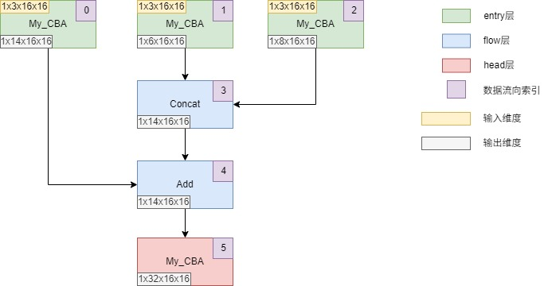
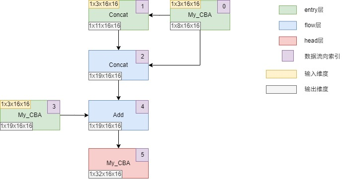
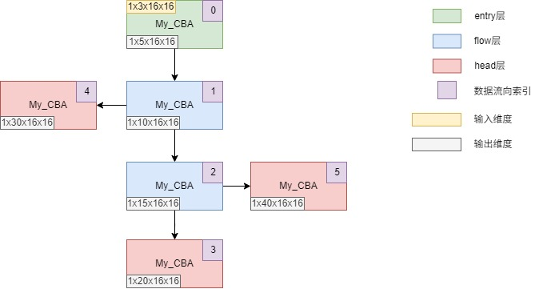
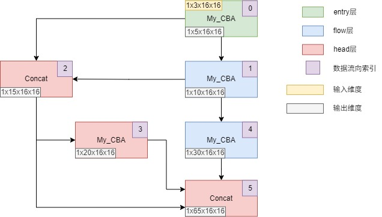
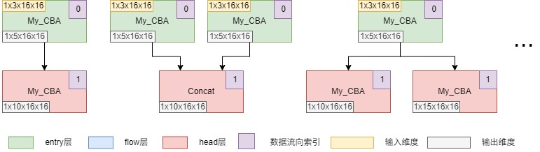

# 创建更复杂的模型

该章节将引导你学习构建支持**任意数量输入**和**任意数量输出**的多输入多输出模型，以及特殊的entry-head模型。

请确保在学习该章节前已学习前置章节：[学习如何使用joint算子](06-joint-operator.md)

## 多输入模型

通过下面内容，你将学习到如何创建一个简单的多输入模型和一个带输入变体的多输入模型。

### 简单的多输入模型

该部分将教学如何创建一个简单的支持三个输入的模型，我们将使用前面章节自定义的`My_CBA`算子和已学习的joint算子来完成构建。

模型架构图见下：


在搭建一个模型架构前，建议：

1. 先手动绘制需要的模型架构草图，如上图。
2. 为不同的模块标记entry、flow和head三种类型。
3. 规划模块之间的数据流向，标记数据流向索引，**避免产生数据流回环**。检定数据流向是否正常无误的标准为：**从任意模块开始，沿着数据流向箭头往下，最终会抵达任意head模块，期间不会产生无限死循环，即回环。**
4. 建议为entry模块标记输入维度和输出维度，为flow和head模块标记输出维度。

根据上面的模型架构图，下面使用yaml文件来编写模型结构：

```yaml
# 简单起见，只写模型网络结构

network:
  - { type: entry, from: [ -1 ], module: My_CBA, repeat: 1, args: { in_channels: 3, out_channels: 14, kernel_size: 3, stride: 1, padding: 1 } }
  - { type: entry, from: [ -1 ], module: My_CBA, repeat: 1, args: { in_channels: 3, out_channels: 6, kernel_size: 3, stride: 1, padding: 1 } }
  - { type: entry, from: [ -1 ], module: My_CBA, repeat: 1, args: { in_channels: 3, out_channels: 8, kernel_size: 3, stride: 1, padding: 1 } }
  - { type: flow, from: [ -1, 1 ], module: Concat, repeat: 1 }
  - { type: flow, from: [ -1, 0 ], module: Add, repeat: 1 }
  - { type: head, from: [ -1 ], module: My_CBA, repeat: 1, args: { in_channels: 14, out_channels: 32, kernel_size: 3, stride: 1, padding: 1 } }
```

Concat算子默认dim=1，因此无需指明args参数。

### 带输入变体的多输入模型

entry层之间接受各自的数据形成变体的形式也是多输入模型的一种，以下展示一种常见的带输入变体的三输入模型。

模型架构图见下：


从上图可见，模型的第1层是entry层，但接受同为entry层的第0层的输入，这是一种常见的变体。

根据上面的模型架构图，下面使用yaml文件来编写模型结构：

```yaml
# 简单起见，只写模型网络结构

network:
  - { type: entry, from: [ -1 ], module: My_CBA, repeat: 1, args: { in_channels: 3, out_channels: 8, kernel_size: 3, stride: 1, padding: 1 } }
  - { type: entry, from: [ -1, 0 ], module: Concat, repeat: 1 }
  - { type: flow, from: [ -1, 0 ], module: Concat, repeat: 1 }
  - { type: entry, from: [ -1 ], module: My_CBA, repeat: 1, args: { in_channels: 3, out_channels: 19, kernel_size: 3, stride: 1, padding: 1 } }
  - { type: flow, from: [ -1, 2 ], module: Add, repeat: 1 }
  - { type: head, from: [ -1 ], module: My_CBA, repeat: 1, args: { in_channels: 19, out_channels: 32, kernel_size: 3, stride: 1, padding: 1 } }
```

上面结构中有几个关键部分需要指出：

1. entry层的from接受的-1表示来自外界的输入，而不是来自上一层的输出。因此，entry如果希望接受来自上一层的输出，则需要指明上一层的索引。
2. entry层不需要全部写在最前面，只要保证数据流向无回环即可，可以写在任意层级。

## 多输出模型

通过下面内容，你将学习到如何创建一个简单的多输出模型和一个带输出变体的多输出模型。

### 简单的多输出模型

该部分将教学如何创建一个简单的支持三个输出的模型。模型架构图见下：



根据上面的模型架构图，下面使用yaml文件来编写模型结构：

```yaml
# 简单起见，只写模型网络结构

network:
  - { type: entry, from: [ -1 ], module: My_CBA, repeat: 1, args: { in_channels: 3, out_channels: 5, kernel_size: 3, stride: 1, padding: 1 } }
  - { type: flow, from: [ -1 ], module: My_CBA, repeat: 1, args: { in_channels: 5, out_channels: 10, kernel_size: 3, stride: 1, padding: 1 } }
  - { type: flow, from: [ -1 ], module: My_CBA, repeat: 1, args: { in_channels: 10, out_channels: 15, kernel_size: 3, stride: 1, padding: 1 } }
  - { type: head, from: [ -1 ], module: My_CBA, repeat: 1, args: { in_channels: 15, out_channels: 20, kernel_size: 3, stride: 1, padding: 1 } }
  - { type: head, from: [ 1 ], module: My_CBA, repeat: 1, args: { in_channels: 10, out_channels: 30, kernel_size: 3, stride: 1, padding: 1 } }
  - { type: head, from: [ 2 ], module: My_CBA, repeat: 1, args: { in_channels: 15, out_channels: 40, kernel_size: 3, stride: 1, padding: 1 } }
```

### 带输出变体的多输出模型

head层之间接受各自的数据形成变体的形式也是多输出模型的一种，以下展示一种稍微复杂一点的带输出变体的三输出模型。

模型架构图见下：



根据上面的模型架构图，下面使用yaml文件来编写模型结构：

```yaml
# 简单起见，只写模型网络结构

network:
  - { type: entry, from: [ -1 ], module: My_CBA, repeat: 1, args: { in_channels: 3, out_channels: 5, kernel_size: 3, stride: 1, padding: 1 } }
  - { type: flow, from: [ -1 ], module: My_CBA, repeat: 1, args: { in_channels: 5, out_channels: 10, kernel_size: 3, stride: 1, padding: 1 } }
  - { type: head, from: [ -1, 0 ], module: Concat, repeat: 1 }
  - { type: head, from: [ -1 ], module: My_CBA, repeat: 1, args: { in_channels: 15, out_channels: 20, kernel_size: 3, stride: 1, padding: 1 } }
  - { type: flow, from: [ 1 ], module: My_CBA, repeat: 1, args: { in_channels: 10, out_channels: 30, kernel_size: 3, stride: 1, padding: 1 } }
  - { type: head, from: [ 2, 3, -1 ], module: Concat, repeat: 1 }
```

如上所见，head也可以继续接受head的结果往下组合输出，通过这种方式可以创建出组合头或解耦头等。

## entry-head模型

entry-head模型只有entry层和head层，可以由任意数量的entry层和head层组合而成。



上图展示了三种不同的entry-head模型。此类模型的用途为：
1. 模型结构比较简单，只有两层深度的情况。
2. 希望隐藏模型的中间结构信息。
3. 模型中间结构过于复杂，不适合分模块的情况。