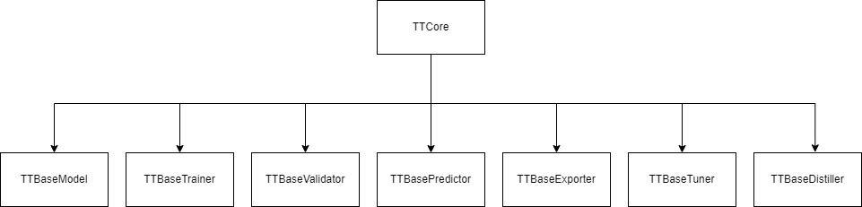

# 学习tinytrain框架核心：Engine

该引导页将引导学习`tinytrain`框架的核心部分，了解什么是`Engine`。

## Engine 概述

`TinyTrain Engine` 是框架的训练引擎核心，采用模块化设计，将深度学习工作流分解为独立且协同的组件。`Engine` 负责协调整个模型生命周期，从训练到部署的各个环节。

`TTBaseCore`模块旗下7大`Engine`模块，由`TTBaseCore`类统一管理。

### TTBaseCore 的作用

`TTBaseCore` 是 `TinyTrain Engine` 的中央协调器和基础设施提供者，它不直接执行具体任务，而是为所有模块提供运行环境、资源管理和协调调度。

#### 七大核心职责

##### 1. 配置管理中心

* 加载和解析 `link` 配置文件
* 管理全局配置状态
* 支持运行时配置覆盖
* 处理配置继承和链式关系

##### 2. 模块注册与发现

* 启动模块注册表系统
* 建立任务类型与具体实现的映射关系
* 提供`Engine`模块发现机制

##### 3. 资源调度器

* 自动检测和分配计算设备 (CPU/CUDA/MPS)
* 管理 GPU 可见性和多卡配置
* 处理分布式训练环境设置
* 优化资源使用效率

##### 4. 生命周期协调器

* 统一对外 API 入口
* 协调训练、推理、导出、调优、蒸馏等流程
* 管理各组件间的依赖和调用顺序
* 确保流程的正确执行

##### 5. 组件绑定工厂

* 按需实例化各个引擎组件
* 管理组件间的依赖注入
* 处理不同使用场景的组件绑定策略

##### 6. 模型管理器

* 模型加载和创建的统一入口
* 自动搜索最优权重文件
* 处理模型配置和规模选择
* 管理模型状态恢复

##### 7. 分布式训练协调器

* 自动检测分布式训练环境
* 管理 DDP 进程启动
* 协调多机多卡训练配置
* 处理进程间通信设置

#### 形象比喻

##### 电影导演🎬

* `TTBaseCore` = 电影导演
* 各个模块 = 演员、摄影、灯光、道具等专业团队
* 训练流程 = 电影拍摄过程

##### 导演（TTBaseCore）的职责：

* 📝 剧本解读：解析配置文件，理解"拍摄要求"
* 🎭 选角管理：根据角色需求选择合适的"演员"（模型和组件）
* 🎥 现场调度：协调各个团队在正确的时间做正确的事
* ⚡ 资源分配：合理分配预算和设备（计算资源）
* 🔄 流程控制：确保拍摄按计划进行（训练流程）
* 🎬 最终呈现：监督后期制作和成品输出（模型导出）

#### 设计哲学

`TTBaseCore` 遵循 "**约定优于配置**" 和 "**开箱即用**" 的设计理念：

* ✅ 简化使用：用户无需关心底层组件协调
* ✅ 统一入口：所有功能通过 `TTBaseCore` 统一访问
* ✅ 智能决策：自动选择最优配置和组件
* ✅ 灵活扩展：支持自定义组件和流程
* ✅ 生产就绪：内置最佳实践和错误处理

### `Engine`模块作用

#### 1. TTBaseModel(模型模块)

作用：模型定义、管理和配置

* 提供统一的模型接口规范
* 管理模型架构和参数
* 支持模型加载和保存
* 处理模型配置和超参数

#### 2. TTBaseTrainer (训练器)

作用：模型训练过程管理

* 执行训练循环（前向传播、损失计算、反向传播、参数更新）
* 管理优化器和学习率调度
* 处理训练数据加载和增强
* 监控训练指标和损失
* 支持断点续训和模型保存
* 支持早停机制（Early Stopping）

#### 3. TTBaseValidator (验证器)

作用：模型验证和评估

* 在验证集上评估模型性能
* 计算准确率、精度、召回率等指标
* 生成验证报告和可视化结果
* 模型性能监控和比较

#### 4. TTBasePredictor (预测器)

作用：模型推理和预测

* 执行单张或批量数据推理
* 处理预测结果后处理
* 支持实时推理和批量预测
* 提供用户友好的预测接口
* 输出格式化和结果可视化

#### 5. TTBaseExporter (导出器)

作用：模型导出和部署准备

* 模型格式转换（PyTorch → ONNX/TensorRT等）
* 模型量化和优化
* 部署配置生成
* 跨平台兼容性处理
* 生产环境适配

#### 6. TTBaseTuner (调优器)

作用：超参数优化和模型调优

* 自动化超参数搜索（进化算法）
* 性能分析和瓶颈识别
* 最优配置推荐

#### 7. TTBaseDistiller (蒸馏器)

作用：知识蒸馏和模型压缩

* 师生模型知识传递
* 模型剪枝和稀疏化
* 量化感知训练
* 轻量级模型生成
* 保持性能的同时减少模型大小

### 下一步

要进一步了解不同的Engine请点击下方连接：
-[TTBaseCore：引擎的核心](01-what-is-core.md)
-[TinyTrain 模型构建指南](02-what-is-model.md)
