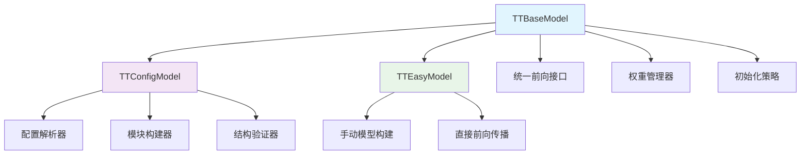
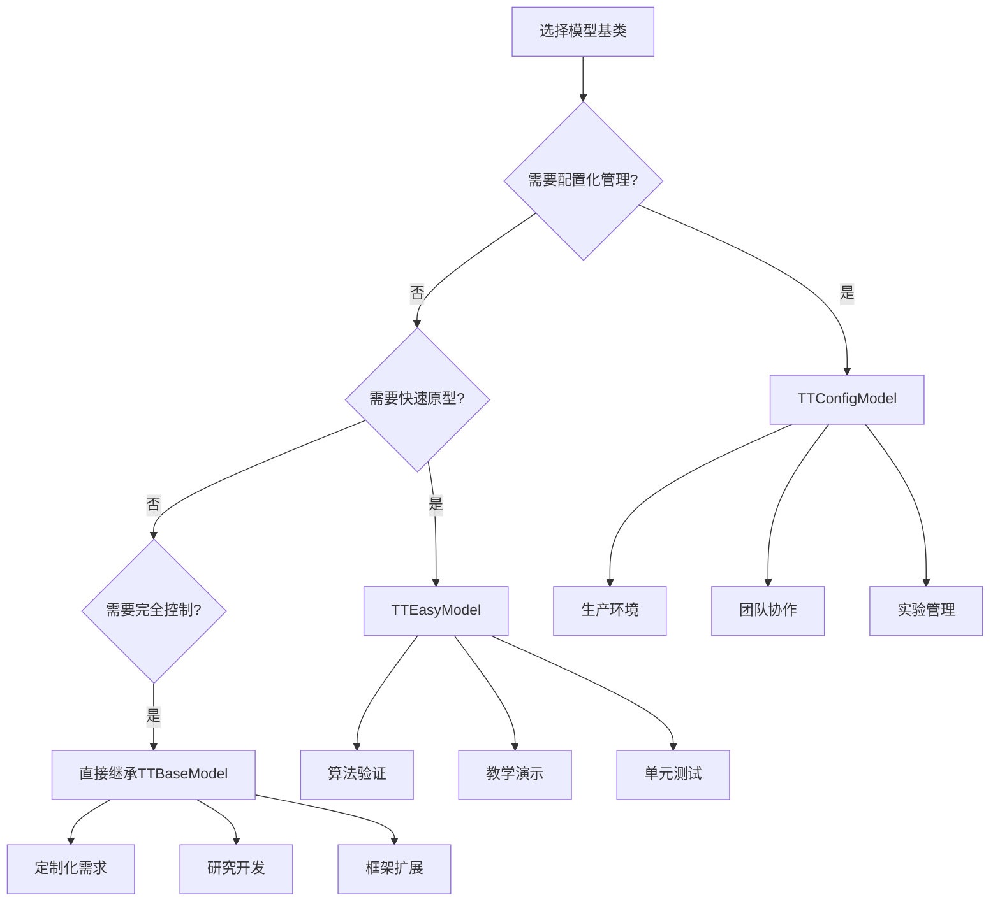
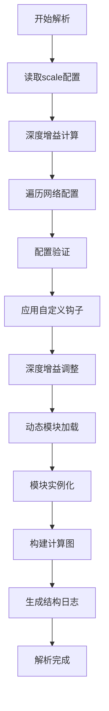

# TinyTrain 模型构建指南

## 目录

- [概述](#1)
- [设计哲学与架构理念](#2)
- [类关系与层次结构](#3)
- [TTBaseModel - 抽象基类深度解析](#4)
- [TTConfigModel - 配置驱动模型完整指南](#5)
- [TTEasyModel - 极简手动模型详解](#6)

<a id="1"></a>

## 概述

`TinyTrain`是一个专为深度学习模型训练设计的轻量级框架，其核心设计目标是提供标准化、可配置且易扩展的建模解决方案。在深度学习项目开发中，模型结构的定义、训练流程的控制、权重管理等问题常常导致代码冗余和维护困难。TinyTrain
通过三个层次化的模型基类，为开发者提供了从快速原型到生产部署的全流程支持。

### 核心价值

1. 统一建模规范：通过抽象基类定义标准接口，确保所有模型遵循相同的设计模式
2. 训练-推理解耦：清晰分离训练和推理逻辑，提高代码可读性和可维护性
3. 灵活的权重管理：支持严格和非严格的权重加载，便于模型迁移和微调
4. 配置驱动开发：通过配置文件定义模型结构，实现声明式编程和实验复现
5. 极简开发体验：为快速原型和算法验证提供最简化的开发接口

### 适用场景

- 学术研究：快速实现和验证新算法想法
- 工业部署：标准化、可维护的生产环境模型
- 教学演示：清晰的代码结构和易于理解的API设计
- 模型迁移：跨项目、跨框架的权重共享和知识迁移

<a id="2"></a>

## 设计哲学与架构理念

### 面向接口编程

`TinyTrain` 采用面向接口的编程范式，通过抽象基类 `TTBaseModel` 定义了一套完整的模型生命周期管理接口。这种设计使得：

- 关注点分离：模型结构、损失计算、权重管理各司其职
- 可替换性：不同实现可以相互替换，只要遵循相同的接口
- 易于测试：每个组件都可以独立测试和验证

### 配置即代码

`TTConfigModel` 体现了"配置即代码"的现代软件工程理念，将模型结构从硬编码中解放出来，通过配置文件进行描述。这种方式的优势包括：

- 可复现性：实验配置可以版本化管理
- 灵活性：无需修改代码即可调整模型结构
- 可视化：配置化的模型结构更易于理解和沟通

### 渐进式复杂度

框架提供了从简单到复杂的三个层次，允许开发者根据实际需求选择合适的抽象级别：

```text
TTEasyModel (极简) → TTConfigModel (配置化) → 自定义TTBaseModel (完全控制)
```

这种渐进式设计降低了学习曲线，同时保证了框架的扩展能力。

<a id="3"></a>

## 类关系与层次结构

### 继承体系详解



### 核心职责分配

TTBaseModel 核心职责：

- 定义抽象接口和基础实现
- 统一训练和推理的前向传播入口
- 提供权重加载和初始化基础设施
- 管理设备分配和配置信息

TTConfigModel 扩展职责：

- 解析和验证模型配置文件
- 动态构建模块化网络结构
- 支持深度增益和模型缩放
- 提供结构化日志和可视化

TTEasyModel 简化职责：

- 极简化的模型构建接口
- 直接封装现有的PyTorch模块
- 快速原型开发支持
- 教学和演示用途优化

### 选择决策树



<a id="4"></a>

## TTBaseModel - 抽象基类深度解析

### 架构设计原理

`TTBaseModel` 作为整个框架的基石，采用了模板方法模式来定义算法的骨架，将具体实现延迟到子类。这种设计确保了：

- 一致性：所有派生类都遵循相同的行为模式
- 可扩展性：易于添加新的模型类型而不影响现有代码
- 维护性：公共逻辑集中在基类，减少代码重复

### 核心方法详解

#### 1. 构造函数设计

```python
def __init__(self, config_manager: TTConfigManager, device: torch.device = None):
    super(TTBaseModel, self).__init__()
    self.config_manager = config_manager  # 配置管理统一入口
    self.device = device  # 设备信息传递
    self.criterion = None  # 延迟初始化损失函数
```

##### 设计考虑：

- `config_manager` 提供统一的配置访问接口
- `device` 参数允许运行时设备指定
- `criterion` 延迟初始化避免不必要的内存占用

#### 2. 统一前向传播

```python
def forward(self, data: BaseBatchDataInfo | torch.Tensor | list[torch.Tensor] | Any | list[Any]):
    if isinstance(data, BaseBatchDataInfo):
        outputs = self.inference(data.data)
        return self.loss(outputs, data)
    else:
        return self.inference(data)
```

##### 智能模式检测：

- 训练模式：输入 继承自`BaseBatchDataInfo`类的子类，自动计算损失
- 推理模式：输入`Tensor`或任意数据即为单输入模型，直接返回预测结果
- 多输入支持：输入列表则即为多输入模型，直接返回预测结果

#### 3. 损失计算框架

```python
def loss(self, preds: list[torch.Tensor], batch_samples: BaseBatchDataInfo) -> tuple[float, dict]:
    return self.criterion(preds, batch_samples)
```

##### 返回格式标准化：

- 总损失值：用于反向传播的标量损失
- 损失分量字典：详细的损失分解，便于监控和调试

### 权重管理机制

#### 1. 智能权重加载

```python
def load_model_state_dict(self, state_dict, force_load=True):
    model_state_dict = self.state_dict()
    match_state_dict = {}

    for key in state_dict:
        if key in self.state_dict():
            if state_dict[key].shape == model_state_dict[key].shape:
                match_state_dict[key] = state_dict[key]
            else:
                if not force_load:
                    raise KeyError(f"形状不匹配: {key}")
                LOGGER.warning(f"跳过不匹配的键: {key}")
        else:
            LOGGER.warning(f"不存在的键: {key}")

    self.load_state_dict(match_state_dict, strict=False)
```

##### 加载策略：

* 严格模式 (force_load=False)：要求完全匹配，否则抛出异常
* 宽松模式 (force_load=True)：跳过不匹配的键，仅加载可用部分
* 形状验证：确保加载的权重与当前模型结构兼容

#### 2. 标准化权重初始化

```python
def initialize_weights(self):
    for m in self.modules():
        t = type(m)
        if t is nn.Conv2d:
            nn.init.kaiming_normal_(m.weight, mode='fan_out', nonlinearity='relu')
        elif t is nn.BatchNorm2d:
            nn.init.constant_(m.weight, 1.0)
            nn.init.constant_(m.bn1, 0.0)
            # ... 其他初始化
```

上述初始化代码是基类创建的通用初始化，并未调用，用户可选重载该函数实现自己所需的初始化。

### 抽象方法

#### 1. init_criterion() - 损失函数初始化

```python
def init_criterion(self) -> TTBaseLoss:
    """
    返回特定于任务的损失函数实例
    
    要求：
    - 必须返回 TTBaseLoss 的子类实例
    - 损失函数应该与模型输出格式匹配
    - 可以考虑从配置中读取损失函数参数
    """
    raise NotImplementedError
```

`TTBaseLoss`类是`tinytrain`框架内所有`loss`的基类，定义`了loss`必须实现的函数，即`loss`计算后返回值的格式。开发者可选择通过继承该类实现属于自己的`loss`类，也可选择不继承，只需实现必须的函数即可。

#### 2. inference() - 推理逻辑实现

```python
def inference(self, *args, **kwargs):
    """
    定义模型在推理模式下的前向传播
    
    要求：
    - 必须处理单输入和多输入场景
    - 返回格式应该与loss函数期望的输入匹配
    """
    raise NotImplementedError
```

开发者在重载`inference`函数时，可参考`TTConfigModel`类与`TTEasyModel`类的实现。

### 完整使用示例

```python
class MyBaseModel(TTBaseModel):
    def __init__(self, config_manager, device):
        super().__init__(config_manager, device)
        # 构建模型结构
        self.backbone = nn.Sequential(...)
        self.head = nn.Linear(...)

        # 初始化损失函数
        self.criterion = self.init_criterion()

    def init_criterion(self) -> TTBaseLoss:
        return nn.CrossEntropyLoss()

    def inference(self, x):
        features = self.backbone(x)
        return [self.head(features)]  # 返回列表格式

    # 可选：重写损失计算以添加自定义逻辑
    def loss(self, preds, batch_samples):
        main_loss = self.criterion(preds[0], batch_samples.labels)
        reg_loss = self.compute_regularization()  # 自定义正则化
        total_loss = main_loss + reg_loss
        return total_loss, {"cls_loss": main_loss, "reg_loss": reg_loss}
```

一般不建议开发者直接继承`TTBaseModel`类来开发新模型，除非对`tinytrain`框架整体有深入了解。

<a id="5"></a>

## TTConfigModel - 配置驱动模型完整指南

### 配置系统架构

`TTConfigModel` 实现了一个完整的配置驱动建模系统，其核心思想是将模型结构从代码中完全解耦，通过声明式配置描述整个网络。

要学习如何创建基于配置驱动的模型，请开始于：[学习创建自定义AI模块](../build_model/01-create-module.md)

### 模型解析引擎

#### 1. 解析流程



#### 2. 深度增益系统

深度增益允许通过配置文件中的`depth`参数控制整个模型的复杂度，以实现同架构不同尺寸的模型。

#### 3. 模块动态加载

get_layer 方法实现了灵活的模块发现机制：

```python
@staticmethod
def get_layer(module_str: str):
    # 1. 完整路径导入
    if "." in module_str:
        return import_full_path(module_str)

    # 2. 候选包搜索
    for pkg in ["torch.nn", "torchvision.ops", "transformers"]:
        layer = import_from_package(pkg, module_str)
        if layer: return layer

    # 3. 全局注册表查询
    return TTModuleRegistry.get(module_str)
```

开发者可根据需求灵活使用自定义算子或第三方库来调用AI算子。通过在候选包搜索列表中添加第三方库，可支持更多第三方库。

### 自定义钩子系统

#### 1. 模型级修改钩子

```python
def custom_modify_model(self, network):
    """
    在整个模型解析前修改网络配置
    
    适用场景：
    - 根据条件动态添加/删除层
    - 批量修改模块参数
    - 实现复杂的模型变体
    """
    # 示例：为所有卷积层添加分组卷积
    for layer_config in network:
        if "Conv" in layer_config.get("module", ""):
            layer_config["args"]["groups"] = 4

    # 示例：在特定位置插入新层
    new_layer = {
        "type": "flow",
        "module": "torch.nn.BatchNorm2d",
        "from": [-1],
        "repeat": 1,
        "args": {"num_features": 128}
    }
    network.insert(3, new_layer)
```

#### 2. 层级参数修改钩子

```python
def custom_parse_model_level(self, level, module_info):
    """
    在每层解析时动态调整参数
    
    适用场景：
    - 基于层号的参数调整
    - 条件化的参数计算
    - 复杂的参数依赖关系
    """
    # 示例：逐层增加通道数
    if module_info["type"] == "flow" and "Conv" in module_info["module"]:
        base_channels = 64
        growth_rate = 2
        current_channels = base_channels * (growth_rate ** (level // 2))
        module_info["args"]["out_channels"] = current_channels

    # 示例：根据层类型设置不同的重复次数
    if module_info["module"] == "ResidualBlock":
        module_info["repeat"] = 3 if level < 5 else 6
```

### 前向传播引擎

#### 1. 数据流管理

```python
def inference(self, data: torch.Tensor | list[torch.Tensor] | Any | list[Any]) -> list[torch.Tensor]:
    """
    接受单个输入或多个输入，多个输入应以列表的形式传递。
    返回列表中包含了单个输出或多个输出。
    """
    outputs = []
    ...
    return outputs
```

要注意的是：

- data如果是list，则列表中每一个输入数据会按顺序依次**从上往下**传递给配置文件中entry层。
- 模型推理输出将返回一个列表，列表中每一个输出数据按顺序**从上往下**依次对应配置文件中的output层。

#### 2. 中间结果缓存

`ask_set` 机制确保多分支结构中中间结果的正确复用：

```python
# 在 parse_model 中构建
ask_set = set()
for level, info in enumerate(network):
    frm = info["from"]
    ask_set.update([f for f in frm if f != -1])  # 排除外部输入

# 在前向传播中使用
if i in self.ask_set:
    self.record_list[i]["data"] = current_data
```

因此，如果有且仅有唯一一层使用上一层的输出，那么使用`from=[-1]`来代替上一层，可节省中间结果缓存，稍微提升一点模型性能。

### 使用示例

下面展示在`TTConfigModel`中loss的定义和使用方式。

创建一个loss类用于计算分类loss：

```python
from tinytrain.loss import TTBaseLoss
from torch import nn
import torch
from tinytrain.data.data_format import ClassifyBatchDataInfo


class ClassifyLoss(TTBaseLoss):
    """
    分类损失。
    """

    def __init__(self):
        """
        Args:
            cls_loss_gain: 分类损失整体权重系数。
        """
        super().__init__()
        self.criterion = nn.CrossEntropyLoss()

    def forward(self, pred: torch.Tensor, batch: ClassifyBatchDataInfo):
        """
        计算分类损失。
    
        Args:
            pred: 模型输出 logits，形状 (B, C)。
            batch: 批数据，需包含 `.target` 字段，形状 (B,)，值为类别索引。
    
        Returns:
            loss: 标量损失。
            loss_items: dict，记录各分量，便于日志打印。
        """
        loss = self.criterion(pred, batch.target)
        loss_items = {"cls_loss": loss.detach()}
        return loss, loss_items
```

这里使用的`ClassifyBatchDataInfo`是`tinytrain`框架已实现的。
如果您不知道什么是`DataInfo`，请参阅：[data-format使用指南](../core/02-data-format)

假设通过配置文件定义的模型是单输入单输出模型，创建分类模型：

```python
from tinytrain.engine import TTConfigModel
from tinytrain.data.data_format import ClassifyBatchDataInfo


class MyClassifyModel(TTConfigModel):
    def init_criterion(self):
        return ClassifyLoss()

    def loss(self, preds: list[torch.Tensor], batch_samples: ClassifyBatchDataInfo):
        # 这里传递preds[0]的原因是模型定义为单输出模型，因此从preds中取出单个输出
        return self.criterion(preds[0], batch_samples)
```

下面是运行流程的伪代码，通过下面代码来了解数据的流动过程。

```python
from tinytrain.cfg import TTConfigManager

if __name__ == '__main__':
    # 创建TTConfigManager
    cfg = TTConfigManager("link.toml")

    # 传递TTConfigManager给MyClassifyModel类进行模型解析
    model: nn.Module = MyClassifyModel(config_manager=cfg)

    # 创建BatchDataInfo
    data_info = ClassifyBatchDataInfo(...)

    # 传递BatchDataInfo计算得到loss
    loss, loss_item = model(data_info)

    # 传递Tensor计算得到模型的输出
    x = torch.randn(1, 3, 224, 224)
    outputs: list = model(x)
```

<a id="6"></a>

## TTEasyModel - 极简手动模型详解
### 设计哲学
`TTEasyModel` 体现了"简单即美"的设计哲学，为那些不需要复杂配置、希望完全控制模型结构的场景提供最直接的解决方案。

### 核心优势
- 学习成本：直接使用PyTorch原生API
- 完全控制：每个细节都可以精确控制
- 快速迭代：修改立即生效，无需配置解析
- 调试友好：标准的PyTorch调试工具完全适用

### 基本使用模式
#### 1. 简单实现
```python
class SimpleClassifier(TTEasyModel):
    def setup_model(self) -> nn.Module:
        """返回一个标准的PyTorch模型"""
        return nn.Sequential(
            nn.Conv2d(3, 32, kernel_size=3, padding=1),
            nn.ReLU(inplace=True),
            nn.AdaptiveAvgPool2d(1),
            nn.Flatten(),
            nn.Linear(32, 10)
        )
    
    def init_criterion(self) -> TTBaseLoss:
        """定义损失函数"""
        return nn.CrossEntropyLoss()
```

#### 2. 复杂模型结构
```python
class ComplexEasyModel(TTEasyModel):
    def setup_model(self) -> nn.Module:
        """构建包含多个子模块的复杂模型"""
        class ResidualBlock(nn.Module):
            def __init__(self, channels):
                super().__init__()
                self.conv1 = nn.Conv2d(channels, channels, 3, padding=1)
                self.bn1 = nn.BatchNorm2d(channels)
                self.conv2 = nn.Conv2d(channels, channels, 3, padding=1)
                self.bn2 = nn.BatchNorm2d(channels)
                self.relu = nn.ReLU(inplace=True)
            
            def forward(self, x):
                identity = x
                out = self.relu(self.bn1(self.conv1(x)))
                out = self.bn2(self.conv2(out))
                out += identity
                return self.relu(out)
        
        return nn.Sequential(
            nn.Conv2d(3, 64, kernel_size=7, stride=2, padding=3),
            nn.BatchNorm2d(64),
            nn.ReLU(inplace=True),
            nn.MaxPool2d(kernel_size=3, stride=2, padding=1),
            ResidualBlock(64),
            ResidualBlock(64),
            nn.AdaptiveAvgPool2d(1),
            nn.Flatten(),
            nn.Linear(64, 1000)
        )
    
    def init_criterion(self):
        return nn.CrossEntropyLoss(label_smoothing=0.1)
```

### 高级用法
#### 1.多输入多输出模型
```python
class MultiIOEasyModel(TTEasyModel):
    def setup_model(self) -> nn.Module:
        """支持多输入多输出的复杂模型"""
        class MultiTaskModel(nn.Module):
            def __init__(self):
                super().__init__()
                self.backbone = nn.Sequential(...)
                self.classifier = nn.Linear(512, 10)
                self.regressor = nn.Linear(512, 1)
                self.detector = nn.Conv2d(512, 4, kernel_size=1)
            
            def forward(self, x):
                features = self.backbone(x)
                
                # 多输出
                cls_output = self.classifier(features.mean([2, 3]))
                reg_output = self.regressor(features.mean([2, 3]))
                det_output = self.detector(features)
                
                return [cls_output, reg_output, det_output]
        
        return MultiTaskModel()
    
    def init_criterion(self):
        # 多任务损失组合
        return MultiTaskLoss()
```

#### 2.动态结构模型
```python
class DynamicEasyModel(TTEasyModel):
    def __init__(self, config_manager, device):
        super().__init__(config_manager, device)
        # 可以从配置中读取参数
        self.num_layers = config_manager.model.get("num_layers", 3)
    
    def setup_model(self) -> nn.Module:
        """根据运行时参数动态构建模型"""
        layers = []
        in_channels = 3
        
        for i in range(self.num_layers):
            out_channels = 64 * (2 ** i)
            layers.extend([
                nn.Conv2d(in_channels, out_channels, 3, padding=1),
                nn.BatchNorm2d(out_channels),
                nn.ReLU(inplace=True),
                nn.MaxPool2d(2)
            ])
            in_channels = out_channels
        
        layers.extend([
            nn.AdaptiveAvgPool2d(1),
            nn.Flatten(),
            nn.Linear(in_channels, 10)
        ])
        
        return nn.Sequential(*layers)
    
    def init_criterion(self):
        return nn.CrossEntropyLoss()
```

